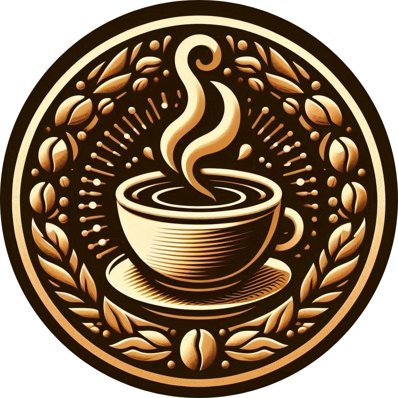

###### *
// design by serene-brew
*

  
  
  ## Serene-Brew

<strong><samp>「</samp></strong>
 
  

    <samp>
        <b>
          Two friends, some code, and a whole lot of open-source love. That's us.  
          We built this organization to contribute to the community and create some cool projects.
          Join the fun!
      </b>
        
    </samp>
  

<strong><samp>」</samp></strong>

 

    

   
  <a href="#readme-top"><kbd>   🡅   </kbd></a>

